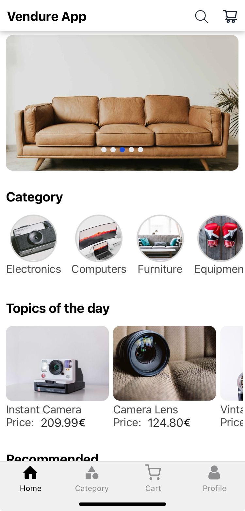

<h1 style="margin: 30px 0 30px; font-weight: bold;">Vendure App</h1>
<h2>E-Commerce application with React Native, GraphQL and TypeScript</h4>

Welcome to the React Native-powered eCommerce application inspired by Vendure.
This application allows companies, which use Vendure for the web, to have the opportunity to enter the mobile application market, without having to create a new application.

Note: This application is only for client mode, i.e. front-end.

## Feature Demo
| Module | Home                                                                                        | skeleton                                                                                       | success                                                                                        | error or empty                                                                                 |
| ------ | ---------------------------------------------------------------------------------------------- | ---------------------------------------------------------------------------------------------- | ---------------------------------------------------------------------------------------------- | ---------------------------------------------------------------------------------------------- |
| Home   |  |  |  |  |


## System Requirements
   - Node.js (v14.x or higher)
   - Expo CLI
   - Npm (recommended)

## Project Configuration

1. Clone the repository:

   ```bash
      git clone https://github.com/Josemarsilvestre/vendureApp.git
      cd vendureApp
   ```
2. Install the dependencies:

   ```bash
      npm install
   ```
## Backend Configuration

This application uses GraphQL in the backend to make calls to the Vendure API.

Make sure you configure the environment variables in the .env, correctly. For testing, you can use the vendure API, mentioned below:

   ```bash
      API_URL=https://demo.vendure.io/shop-api
   ```

## Project Execution

To launch the app on an emulator or physical device, type:

   ```bash
      npx expo start
   ```

From there, you can choose to run the app on an emulator, on a connected device, or through Expo Go, via the QR code.

## Project Structure

The structure of the project is organized as follows:

   - /assets: Static assets such as images and fonts.
   - /reports: weekly report of the application, school use.
   - /src: Configuration of the api, mutation, context, gql and types that the application uses.
   - /utils: Utility functions for common tasks.

## Contribution
Contributions are welcome! If you encounter bugs, performance issues, or have suggestions for new features, feel free to open an issue or submit a pull request.

## License
This project is licensed under the MIT License(https://opensource.org/licenses/MIT).
